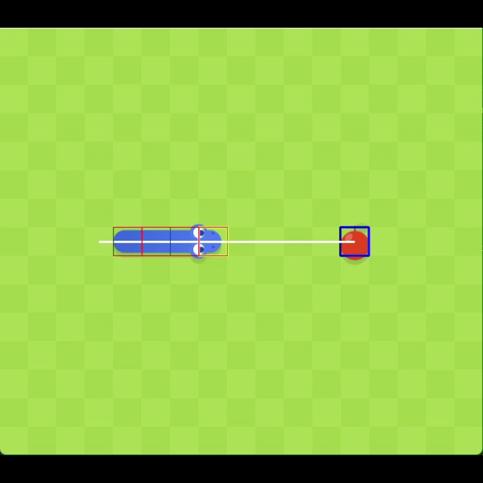

# Snake Bot

A Python script that plays the Google Snake game by interacting with the screen and keyboard.

**Note:** This project is a work in progress. It's far from optimized and the code is not elegant — but it plays!

## Requirements
- Python 3.x
- `pyautogui`
- `opencv-python`
- `numpy`
- `dxcam`

## Performance Note
The code is relatively slow, so the hardware you're running it on can significantly impact its functionality.  
This was made just for fun — no guarantees on performance or reliability :)